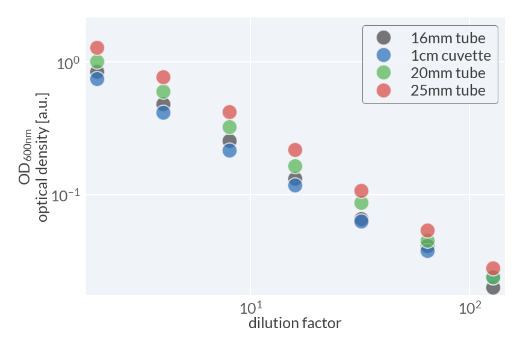
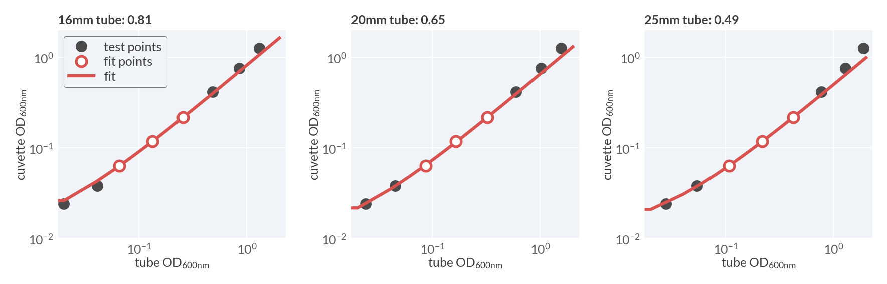

# 2024-05-17 Spectrophotometer Calibration
This experiment was performed to recalibration the spectrophotometer used for 
measurement of growth curves and total biomass concentration. The goal was to 
determine the appropriate calibration factor to convert the optical density 
measured in tubes of various diameters to a standard 1cm path length quartz 
cuvette. 

## Materials & Equipment
### Media

| **Label** | **Buffer Base** | **Carbon Source & Concentration** |
|:--:|:--:|:--:|
| LB | complex and undefined | complex and undefined|
| acetate | N-C- | 30 mM acetate|
| buffer | N-C- | no carbon added|

## Results
The experiment worked nicely, with consistent calibration factors determined by
restricting the optical density range the approximately linear regime of 
the spectrophotometer of $OD_{600nm} \in [0.04 - 0.45]$

**Calibration Factors**
| **Tube Diameter [mm]** | **Cuvette Calibration Factor**|
|:--:|:--:|
|16mm (green cap)| 0.81 |
|20mm (red cap) | 0.65 |
|25mm (blue cap) | 0.49 |

**Plot of raw OD measurements from dilution series**

**Plot of linear calibration fit**

## Protocol

1. A seed culture was prepared by inoculating 3mL of LB growth medium with 
a colony from a freshly struck plate of NCM3722 (WT *Escherichia coli*). The 
seed culture was allowed to grow at 37° C in a waterbath with vigorous aeration.

2. Once the OD of the culture reached ≈ 0.3, 50µL of the seed culture was transferred 
to 75 mL of N-C- acetate medium in a flat-bottom erlenmeyer flask. This culture 
was allowed to grow approximately 18 hours overnight into the deep saturation phase. 

3. A dilution series of this culture was then prepared using the N-C- buffer base 
supplemented with 10mM NH$_4$Cl but no added carbon. This was to ensure that 
the culture would not grow between when the dilution series was prepared and the 
measurements were made. 

4. A factor-of-two dilution series (0, 2, 4, 8, 16, 32, 64, and 128 fold dilutions into 10 mL of media) was prepared from the saturated culture into clean and sterile 25mm diameter tubes (blue caps). A blank was also prepared using the carbon-free N-C- buffer base. The OD$_{600nm}$ was measured for each diluted culture and recorded in my paper notebook.

5. From each tube, 5 mL was transferred into a corresponding clean and sterile 20mm diameter tube (red caps), including the blank. The optical density was then recorded 
as in step 4. 

6. Step 5 was repeated by transferring 3mL volume into clean and sterile 16mm diameter 
tubes (green caps), including the blank.

7. Once the tube OD measurements were collected, a quartz cuvette was installed into 
the spectrophotometer and was thoroughly cleaned with water and blanked with 200µL of 
carbon free buffer base media. From each tube in step 6, 200 µL was transferred to the
quartz tube and the optical density was recorded. Between measurements, the cuvette 
was washed with 2 x 2mL volumes of ddH$_2$O.

8. Once complete, the cultures were disposed of and the data was manually transferred 
to a CSV file. Analysis was performed as in the `processing.py` file in this directory.